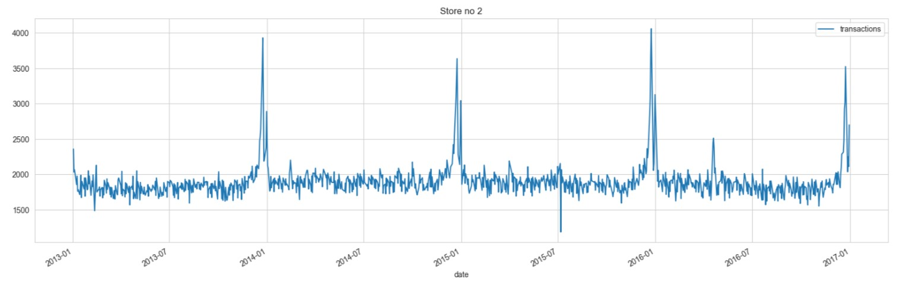
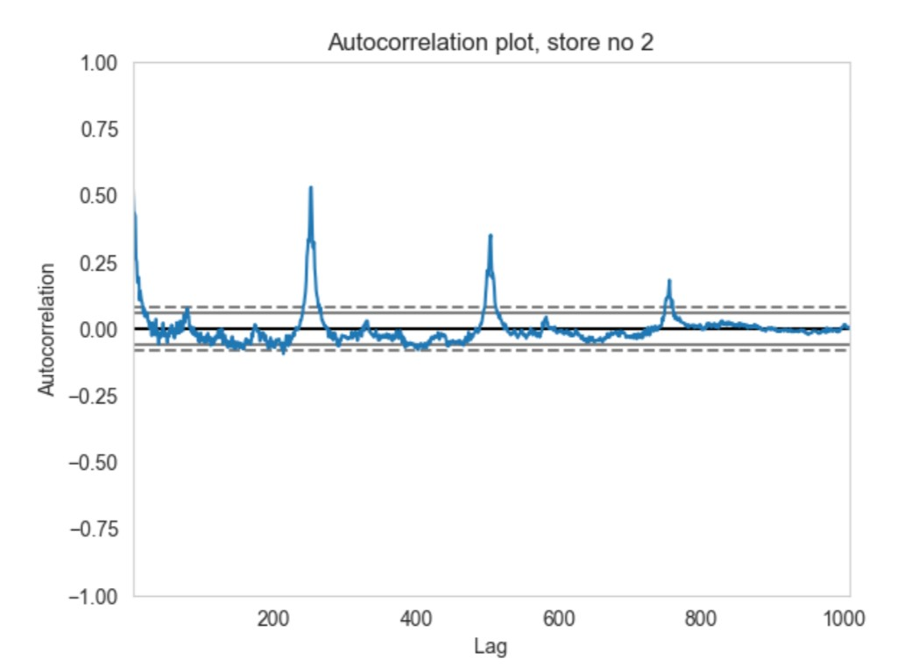
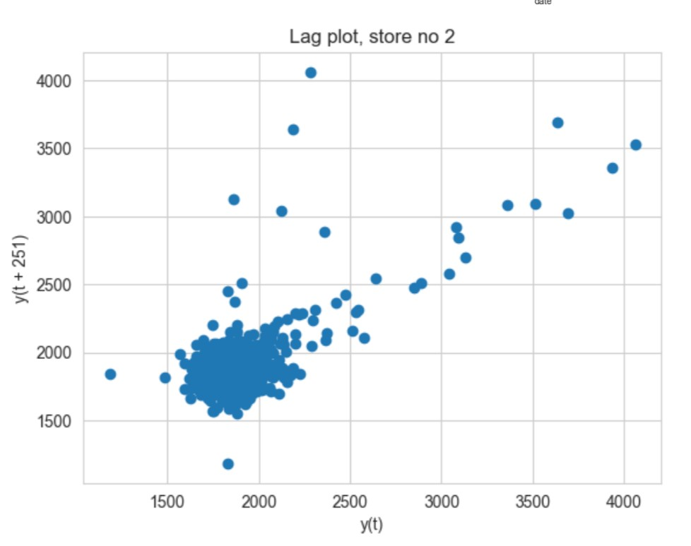
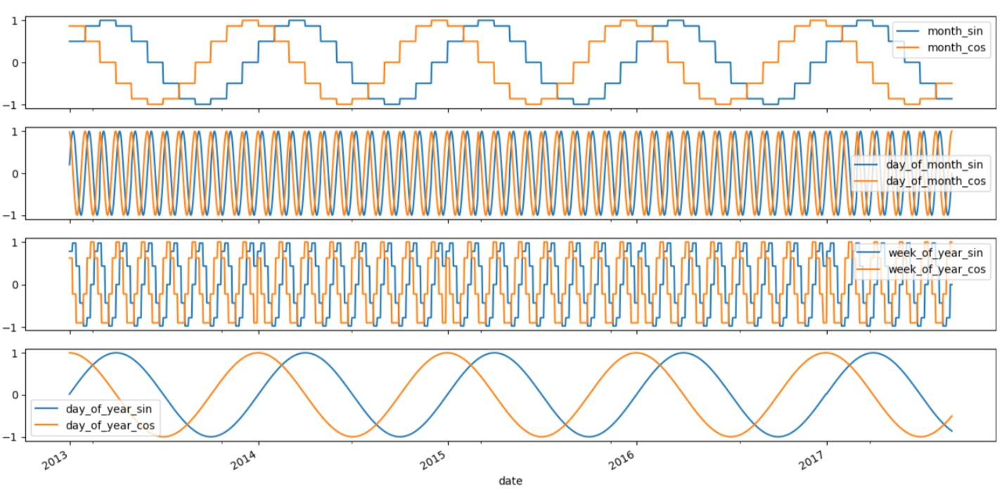
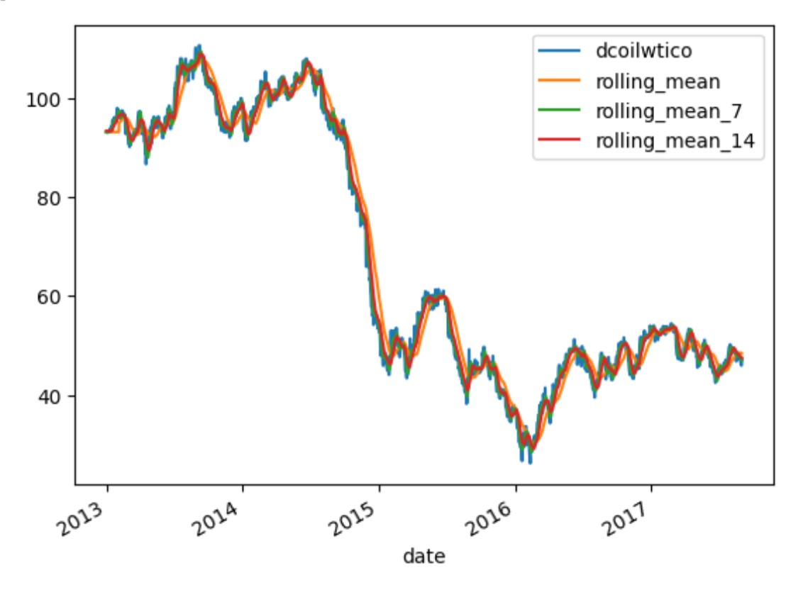
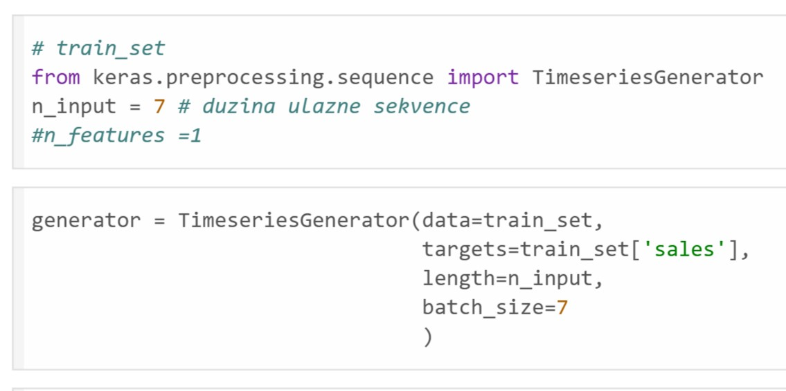
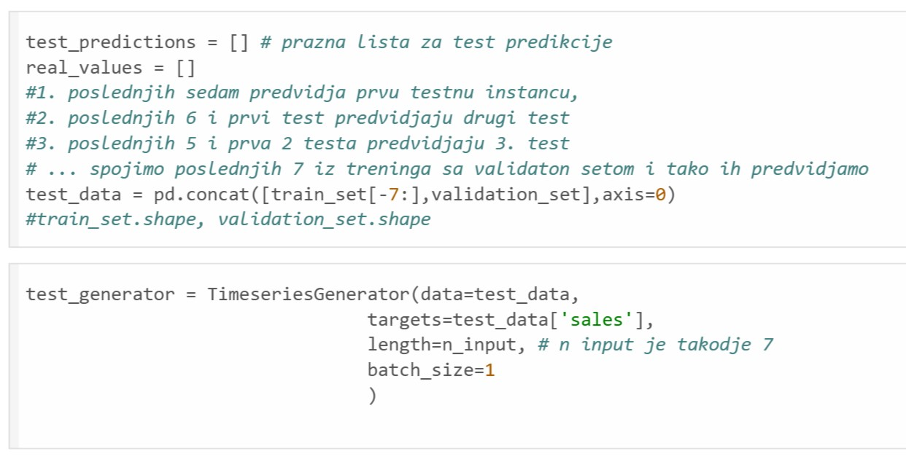
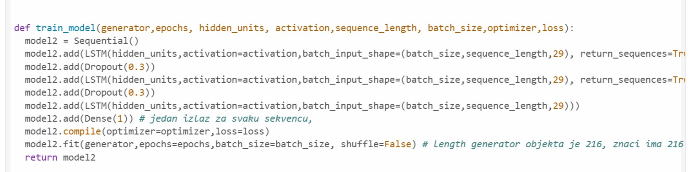
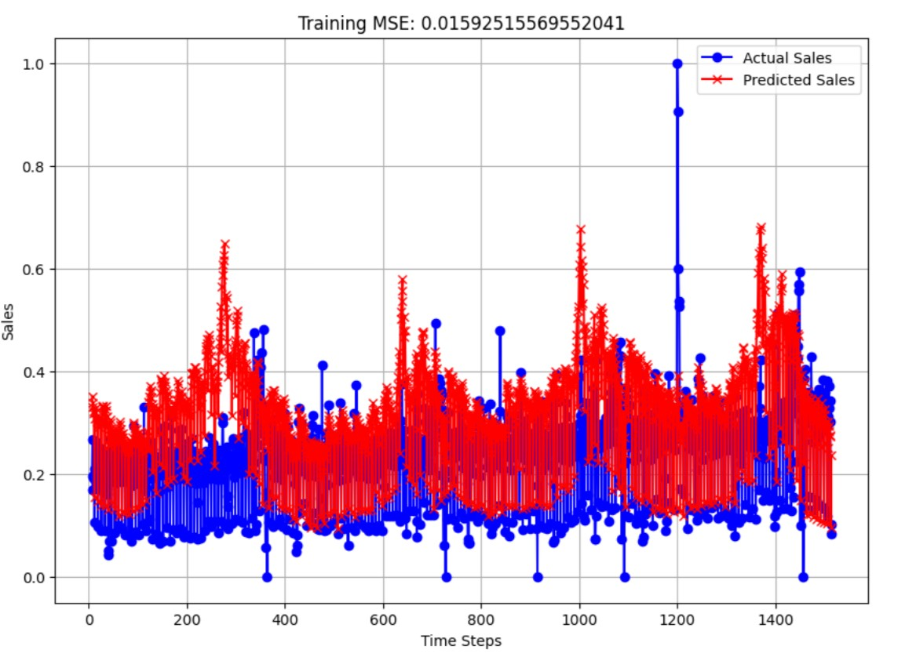
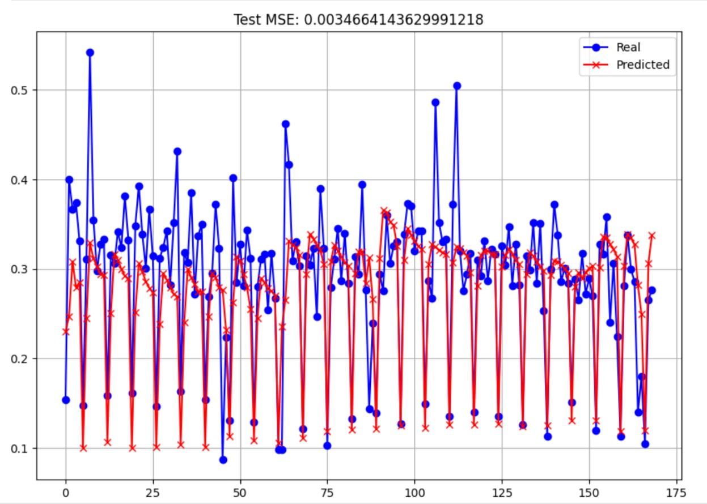

### Connected CSV files:
1. **train.csv** - The training data, comprising time series of features store_nbr, family, and onpromotion as well as the target sales.
2. **stores.csv** - Store metadata, including city, state, type, and cluster.
3. **oil.csv** - Daily oil price. Includes values during both the train and test data timeframes.
4. **holidays_events.csv** - Holidays and Events, with metadata
5. **test.csv** - Test data.
6. **transactions.csv** - data about all transactions for each store during the observed dates.
7. **formodel.csv** - cleared data which is result of executing StoreSales.create_dataset()
All data can be found [here](https://drive.google.com/drive/folders/1GsGW5P7WUz93nP6JpQmecc6UMpfyOsZB)
### 1. Creating dataset: 
*Based on the referenced .csv files, a unified dataset was created, which was used for further processing, filling missing values, and making final predictions. The dataset was obtained by calling the **create_dataset()** method in the [StoreSales.py](https://github.com/zm20200109/Stores-Sales-Prediction/blob/main/code/StoreSales.py) file.*

### 2. Filling NaNs:

**To fill missing values**, autocorrelation and lag plot were used. A method was created to isolate the peak of the plot and fill the missing values with the value of the corresponding attribute from the past time with the highest autocorrelation, **considering seasonality observed in attributes** such as transactions.

**For example:**
1.  Plot the transactions:

2.  See autocorrelation plot:

3. Lag plot for transactions:

### 3. Feature engineering: 

In the file [final_notebook.csv](https://github.com/zm20200109/Stores-Sales-Prediction/blob/main/code/final_notebook.ipynb), the final dataset with filled missing values was loaded. 

**New attributes** were created, including *day, month, year, specific seasons for the Ecuador region (dry and wet), and binary variables identifying national holidays, local holidays, events, and weekends**. 

**Sinusoidal and cosine transformations** were applied to temporal attributes to help the model recognize close values (e.g., the 31st day of one month and the 1st day of the next month). 

**Rolling mean attributes** were created for transactions and oils. The data was transformed using a **Column Transformer** and scaled using **MinMax** scaler to range values from 0 to 1.

### 4. Preparing data for model:

Data preparation for the model involves creating **sequences of 7 observations each**, with a **batch size of 7**. 

To achieve this, the **TimeSeriesGenerator** is used. The last sequence of the training set is concatenated with the test set to predict the value of the first test sequence. This is done with a batch size of 1, which is fed into the model.

### 5. Model
A Long Short-Term Memory (LSTM) neural network with 100 hidden units was utilized, employing a Dropout layer after each LSTM layer to prevent overfitting. The model was trained for 200 epochs using the ReLU activation function.

At the very end of the file, the complete code is summarized, applying the model and data preparation for any store and family of products.

 

